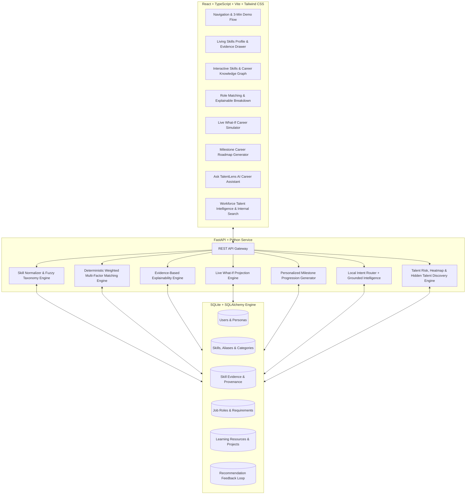

# TALENTLENS — AI Talent Discovery & Career Intelligence Platform

> **"A person's potential is bigger than their job title or resume."**
> 
> Discover Talent. Unlock Potential. Connect Opportunity.

---

## 1. Executive Summary & Problem Statement

Traditional talent platforms match static resume keywords to static job descriptions. This approach fails three critical groups:
1. **Students & Freshers**: Lacking formal job titles, their demonstrated project and coursework capability goes unrecognized.
2. **Employees & Job Seekers**: Trapped in existing titles (e.g. *Support Engineer*), their transferable skills (e.g. *SQL, Incident Analytics, Power BI*) remain invisible.
3. **Organizations & HR**: Companies spend millions recruiting externally while overlooking internal high-potential talent already in their ecosystem.

**TalentLens** is a next-generation AI talent intelligence platform that constructs a **Living Skills Knowledge Graph**, uncovers hidden capabilities with transparent evidence citations, executes multi-factor explainable role matching, powers real-time **What-If** career simulations, generates structured milestone roadmaps, and provides organizational workforce analytics.

---

## 2. System Architecture



---

## 3. Key Features

### 🌟 1. Living Skills Profile & AI Inference with Human-in-the-Loop
- Extracts and normalizes skills against a canonical taxonomy with fuzzy matching.
- Discovers hidden/transferable skills from execution context (e.g., ticket telemetry $\to$ Data Analysis).
- Clearly badges inferred capabilities (`AI-Inferred — verify`) with confidence scores.
- Allows users to **Confirm**, **Reject**, or **Edit** inferred skills, with rejected skills immediately purged from matching.

### 🔍 2. Interactive Living Skills Knowledge Graph
- Visual multi-entity network mapping **Person $\to$ Projects $\to$ Verified/Inferred Skills $\to$ Target Roles**.
- Interactive node inspector displaying evidence, proficiency, and connected requirements in real-time.

### 🎯 3. Multi-Factor Explainable Role Matching
- Zero random numbers or black-box predictions. Multi-factor weighted formula:
  - Skill Coverage: 40%
  - Proficiency & Depth Multiplier: 25%
  - Seniority / Experience Alignment: 15%
  - Evidence Recency: 10%
  - Learning Velocity & Project Rigor: 10%
- Detailed *"Why this match?"* modal citing verified project records and explaining missing gaps.

### ⚡ 4. Live "What-If I Learn This Skill?" Simulator
- Interactive sandbox allowing candidates to simulate acquiring new skills (e.g. `+Python`, `+Statistics`).
- Dynamically re-executes the matching engine across all roles, projecting score increases (e.g. **73% $\to$ 92%**) and highlighting newly unlocked opportunities.
- Labeled with responsible AI disclaimer: *"Projected model score — not a hiring guarantee."*

### 🗺️ 5. Personalized Milestone Career Roadmap
- Generates a structured 3-phase progression timeline (**0–3 Months**, **3–6 Months**, **6–12 Months**) linking to curated courses, sandbox projects, and internal gig assignments.

### 🤖 6. Grounded AI Career Assistant ("Ask TalentLens")
- Context-aware conversational assistant answering:
  - *"Which roles fit my current skills?"*
  - *"What skills am I missing for Data Analyst?"*
  - *"Why was I recommended this role?"*
  - *"What should I learn first?"*
- Powered by hybrid deterministic routing with response caching (zero external rate-limits or API failures).

### 📊 7. HR Workforce Intelligence Dashboard
- High-level KPIs: Total Talent Indexed, Verified Skills, AI Inferred Skills, Internal Mobility Ready candidates, Critical Skill Risks.
- **Hidden Talent Panel**: Surfaces employees whose capabilities qualify them for other departments (e.g., Priya Sharma in Support $\to$ Data Analyst).
- **Internal Talent Search**: 3-tier readiness ranking (**Ready Now $\ge$85%**, **Near Ready 75-84%**, **Upskill Potential 60-74%**).
- **Department $\times$ Skill Heatmap** and **Skill Concentration Risk Alerts**.

---

## 4. Curated 3-Minute Hackathon Demo Journey

Click the top **"3-Min Demo"** button on the interface to step through the curated story:
1. **Priya Sharma Profile**: View current role (*Support Engineer*) and reveal hidden *SQL, Power BI, and Data Analysis* capabilities.
2. **Skills Knowledge Graph**: Inspect node linkages from Priya's incident project to Data Analyst role.
3. **Role Matches**: Review Data Analyst match with evidence breakdown.
4. **Skill Gaps**: Review covered skills vs missing prerequisites (*Python, Statistics*).
5. **What-If Simulator**: Add *Python* + *Statistics* to project score increase to **92%** and unlock roles.
6. **Career Roadmap**: View 0-12 month structured transition roadmap.
7. **AI Assistant**: Ask *"Which roles fit my skills?"* for data-grounded guidance.
8. **HR Intelligence**: Switch to *Ananya HR*, discover Priya as an internal candidate, and view workforce risk metrics.

---

## 5. Technology Stack & Local Resilience

- **Backend**: Python 3.14, FastAPI, SQLAlchemy, SQLite, Pydantic, Pytest.
- **Frontend**: React 18, TypeScript, Vite, Tailwind CSS, Lucide Icons, Recharts, Canvas-Confetti.
- **AI Architecture**: Hybrid Local-First Engine. 100% resilient with zero external API key requirements, guaranteed offline demo stability, and instant response times.

---

## 6. Quick Start & Execution

### Prerequisites
- Python 3.10+
- Node.js 18+

### Setup & Launch
1. **Seed Database**:
   ```bash
   python backend/scripts/seed.py
   ```
2. **Run Backend (FastAPI)**:
   ```bash
   python -m uvicorn app.main:app --host 127.0.0.1 --port 8000 --app-dir backend
   ```
3. **Run Frontend (Vite)**:
   ```bash
   cd frontend
   npm run dev
   ```
4. **Open Browser**: Navigate to `http://localhost:5173/`

### Run Automated Test Suite
```bash
pytest backend/tests/test_matching.py
```
*(All 7 core matching, normalization, and API test cases pass with 100% success)*.

---

## 7. Responsible AI & Ethical Framework

- **Evidence First**: Every recommendation cites concrete execution artifacts.
- **Human in the Loop**: AI infers; candidates verify, edit, or reject.
- **Protected Attributes Excluded**: Scoring strictly excludes gender, age, ethnicity, religion, or location.
- **Transparent Labelling**: Probabilistic inferences are explicitly badged with confidence scores.
